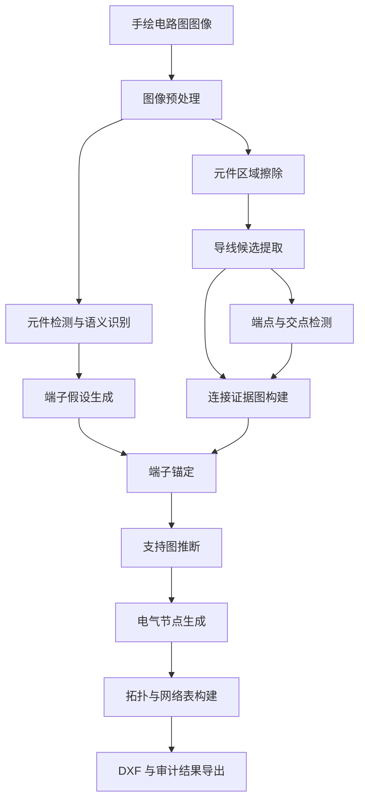

# 面向手绘电路图的结构化拓扑恢复方法研究

## 摘要

手绘电路图识别的核心目标并不是对图像中的线条进行像素级复原，而是从非标准、噪声较多的手绘图像中恢复具有电气意义的结构化拓扑。传统基于直线检测和几何聚类的方法在手绘场景中容易受到断笔、抖动、字母标注、元件粘连和绘图风格差异的影响，导致导线恢复结果不稳定，并进一步影响节点和网络关系的判断。针对这一问题，本文提出一种以元件语义为先导、以导线证据为中间表示、以端子锚定和支持图推断为核心的手绘电路图拓扑恢复方法。

该方法首先利用目标检测模型获得元件区域与类别信息，并根据元件边界框和周围导线关系生成端子假设；随后在擦除元件区域后的图像上提取导线候选，将导线段、端点和交点组织为连接证据图；进一步利用端子位置对连接证据进行支持性标记，过滤缺少电气语义支撑的孤立噪声；最后从支持图中生成电气节点，并构建元件连接关系、网络表和工程导出结果。在此基础上，系统进一步引入基于 LLM 的智能体工作流，对确定性主链路输出进行审计、工具调用、修复候选 dry-run、人类批准后的修复回放、结果评估和失败模式记忆。实验表明，该方法能够在多个典型手绘电路样例上稳定恢复结构化拓扑，并输出可审计、可复核、可编辑的工程结果。

**关键词：** 手绘电路图；拓扑恢复；导线证据；端子锚定；电气节点；网络表；DXF

## 1 引言

电路图是电子系统设计与分析中的重要表达形式。随着图像识别技术的发展，自动从电路图图像中恢复结构化信息具有较高的应用价值，例如辅助电路归档、原理图重建、教学场景分析以及从纸质草图到工程文件的转换。与标准原理图不同，手绘电路图通常缺少严格的符号规范和绘图约束，因此直接将常规文档图像处理或标准图纸解析方法应用于手绘图像时，往往难以获得稳定结果。

手绘电路图识别面临的主要困难包括以下几个方面。首先，手绘导线并不总是连续、笔直或完全闭合，断笔和局部缺失十分常见。其次，元件符号与导线之间可能产生粘连，导致简单的连通域分析难以区分元件和连接线。再次，电路图中的文字标注、元件编号和背景纹理可能被误识别为导线。最后，不同绘图者的绘图习惯差异较大，同一种电路结构可能呈现出不同的线条形态。

如果将任务目标设定为“完整恢复所有手绘线条”，系统会过度依赖底层导线提取质量。当直线检测结果出现轻微偏差时，后续节点聚类和网络构建就可能产生连锁错误。本文认为，手绘电路图识别更合理的目标是恢复电气拓扑，而非复原像素级图形。因此，导线检测结果应被视为连接证据，而不是最终连接事实。

基于这一认识，本文构建了一套分层拓扑恢复流程。系统先利用元件检测结果建立较稳定的语义约束，再从图像中提取导线候选作为证据，最后通过端子锚定和支持图推断恢复电气节点。本文的主要贡献可以概括为：

1. 提出一种面向手绘电路图的“语义层-证据层-推断层”拓扑恢复框架。
2. 将导线提取结果从最终判断依据降级为可审计的连接证据，降低对完美导线恢复的依赖。
3. 引入基于端子锚定的支持图机制，用于筛除缺少电气意义的孤立几何证据。
4. 构建从支持图生成电气节点的主链路，并保留回退机制以提高系统稳定性。
5. 构建智能体增强层，使 LLM 在安全工具约束下完成审计、修复候选复核、语义评估和失败模式记忆，而不直接修改底层拓扑。

## 2 问题定义

给定一张手绘电路图图像，本文的目标是恢复其结构化电气拓扑。系统输入为二维图像，输出包括元件集合、端子集合、电气节点集合、端子到节点的连接关系、网络表以及工程导出结果。

本文将电路拓扑表示为由元件、端子和电气节点组成的结构：

```text
T = (C, P, N, E)
```

其中，`C` 表示元件集合，`P` 表示端子集合，`N` 表示电气节点集合，`E` 表示端子与电气节点之间的连接关系。若多个端子连接到同一个电气节点，则它们属于同一条电气网络。最终输出的网络表可以视为对节点集合及其关联端子的结构化描述。

本文关注的不是图形外观的精确复原，而是以下语义问题：

- 图中包含哪些电路元件。
- 每个元件具有哪些可连接端子。
- 每个端子连接到哪个电气节点。
- 哪些端子属于同一条网络。
- 能否将恢复结果导出为可检查的工程文件。

## 3 方法

### 3.1 方法概述

本文方法由三个层次组成：元件语义层、连接证据层和拓扑推断层。整体流程如图所示。



元件语义层负责提供元件类别、位置和端子假设；连接证据层负责从图像中提取可能属于导线的几何结构；拓扑推断层则结合端子和导线证据，判断哪些几何结构具有电气意义，并生成最终拓扑。

### 3.2 元件语义层

元件语义层首先利用目标检测模型识别电路元件的位置和类别。检测结果以元件边界框的形式传递给后续模块。与直接从像素中寻找端子不同，本文根据元件类别、边界框几何和周围导线关系生成端子假设。

对于常见二端元件，系统首先判断元件主要连接方向。如果导线证据主要出现在元件左右两侧，则元件端子被认为沿水平方向分布；如果导线证据主要出现在上下两侧，则端子沿竖直方向分布。该策略利用元件区域提供的稳定语义约束，避免完全依赖局部像素形态检测端子。

这一层的输出不是最终连接关系，而是后续推断使用的端子锚点。端子锚点在整个系统中具有重要作用：它们为导线证据赋予电气语义，也为后续筛除噪声提供依据。

### 3.3 连接证据层

在获得元件边界框后，系统首先将元件区域从骨架图像中擦除，以减弱元件符号对导线提取的干扰。随后使用直线检测、共线合并和直角规整等方法提取导线候选。

由于手绘线条具有不稳定性，本文不要求导线提取结果完整闭合。每条导线候选仅被视为连接证据，并附带来源、保留原因和证据强度等信息。较长的线段、具有共线支撑的线段以及可能桥接两个区域的线段会被赋予较高的证据强度；缺少结构支撑但仍被保留的线段则具有较低可信度。

在此基础上，系统进一步检测端点和交点，并将导线段、端点、交点统一组织为连接证据图。证据图中的连通分量表示几何上相互接触的一组导线证据。需要强调的是，这些连通分量仍然只是几何证据，并不等价于最终电气节点。

### 3.4 端子锚定

为了判断哪些导线证据具有电气意义，系统以端子为锚点，在端子朝向上建立局部搜索区域。对于每个端子，系统计算其附近导线证据与端子的几何关系，包括距离、前向位置、横向偏移和方向一致性。

端子与证据之间的匹配质量由局部附着分数表示。该分数综合考虑三类因素：

1. 证据是否位于端子朝向的合理区域内。
2. 证据与端子轴线的横向偏移是否较小。
3. 证据方向是否符合端子连接方向。

通过这种方式，系统能够回答“某个端子最可能连接到哪一组导线证据”。这一过程避免了仅通过节点中心距离进行匹配的问题，使端子位置在拓扑恢复中发挥更强的约束作用。

### 3.5 支持图推断

端子锚定结果被反向标记到连接证据图上，形成支持图。支持图的核心作用是区分具有电气意义的导线证据和缺少端子支撑的孤立几何结构。

一组导线证据如果被端子直接支持，则被认为具有较强电气意义；如果它本身没有被端子直接支持，但位于多个受支持证据之间，并通过合理桥接关系连接它们，则可以被视为中继证据；如果一组证据既没有端子支持，也没有合理路径支持，则被视为无支撑证据，在后续节点生成中通常被丢弃。

支持图推断的意义在于，它将导线提取中的几何不确定性转化为可解释的电气支持关系。系统不再简单地“见线就收”，而是要求导线证据与端子或主连接路径之间存在合理联系。

### 3.6 电气节点生成

在支持图基础上，系统仅保留具有电气意义的证据分量，并根据它们之间的桥接关系生成电气节点。若多个受支持的导线证据通过可信桥接关系连通，则它们被合并为同一个电气节点；若某个证据分量缺少支持，则不会进入最终节点集合。

为了保证系统稳定性，本文保留了传统几何节点生成结果作为对照，并将基于支持图生成的节点与传统节点进行比较。比较指标包括节点所包含导线证据的一致性和关联端子的一致性。当支持图节点结果与传统结果高度一致，且不会导致连接数量下降或拓扑一致性变差时，系统采用支持图节点作为主链路输出；否则可以回退到传统结果。

### 3.7 拓扑构建与导出

电气节点确定后，系统将端子匹配到节点，并构建元件-端子-节点之间的连接关系。连接到同一节点的端子被归为同一网络，从而形成网络表。最后，系统将拓扑结果导出为结构化数据、网络表、可视化叠加图和 DXF 文件。

此外，系统还生成统一的审计结果，其中包含拓扑摘要、风险标记、低置信连接、无支撑证据、中继证据和导出状态。这些审计信息既方便人工调试，也为后续智能审计模块提供输入。

## 4 实验与结果

### 4.1 实验设置

当前实验选取四类典型手绘电路图样例进行验证，分别覆盖串联回路、并联分支、带手写标注干扰的电路以及较小规模的简化电路。实验重点不是评估元件检测模型本身，而是验证从元件检测框到拓扑、网络表和 DXF 导出的后续流程。

实验观察指标包括：

- 是否成功生成电气节点。
- 是否恢复所有端子连接。
- 是否生成合理网络表。
- 是否启用回退机制。
- 拓扑一致性检查是否通过。
- 是否成功导出 DXF。
- 是否产生需要人工关注的风险标记。

### 4.2 实验结果

当前 2.0 版本在四个样例上的结果如下。

| 样例 | 元件数 | 端子数 | 节点数 | 网络数 | 拓扑一致性 | 是否回退 | 是否导出成功 | 审计状态 |
| --- | ---: | ---: | ---: | ---: | ---: | --- | --- | --- |
| 001 串联回路 | 3 | 6 | 3 | 3 | 1.0 | 否 | 是 | 通过但有警告 |
| 003 并联分支 | 3 | 6 | 2 | 2 | 1.0 | 否 | 是 | 通过但有警告 |
| 004 手写标注干扰 | 3 | 6 | 3 | 3 | 1.0 | 否 | 是 | 通过但有提示 |
| 005 简化电路 | 2 | 4 | 2 | 2 | 1.0 | 否 | 是 | 通过但有警告 |

四个样例均成功采用支持图生成的节点结果，并且没有触发回退机制。所有样例均完成网络表和 DXF 导出。审计结果中的警告主要来自个别端子到节点的低置信匹配，这类警告并不表示拓扑必然错误，而是提示该连接在几何上存在较大偏移或局部证据较弱，适合后续人工或智能审计重点检查。

### 4.3 结果分析

实验结果表明，基于端子锚定和支持图推断的方法能够缓解单纯依赖导线提取带来的不稳定性。在串联和并联样例中，系统能够正确区分不同电气节点，并恢复元件之间的网络关系。在含有手写标注干扰的样例中，系统能够将部分缺少端子支持的几何证据识别为无支撑证据，从而避免其污染最终拓扑。

同时，实验也显示出当前方法的边界。对于端子附近导线偏移较大、线段断裂明显或文字干扰较强的区域，系统仍可能产生低置信连接或中继证据提示。此类问题说明底层导线证据仍然会影响拓扑推断质量，因此后续仍需要进一步增强桥接推断、复杂交点判断和候选修复能力。

## 5 讨论

本文方法的核心优势在于将手绘电路图恢复任务从“像素级导线复原”转化为“基于证据的电气拓扑推断”。这种转化使系统能够容忍一定程度的导线缺失和局部噪声，同时通过端子锚定保持拓扑判断的可解释性。

与完全依赖几何聚类的方法相比，支持图机制具有两个优点。首先，它能够过滤缺少端子支持的孤立线段，减少文字、噪声和残留符号对最终节点的影响。其次，它保留了中继证据的表达能力，使系统在面对局部断裂时不必立即丢弃所有非直接支持证据，而是根据路径关系判断其是否仍有电气意义。

不过，当前系统仍属于规则驱动的确定性方法，其效果受若干参数影响。例如导线候选提取、端子搜索区域和桥接距离都会影响最终结果。虽然这些参数具备明确几何含义，但在更多绘图风格下仍需要系统性验证。后续工作应引入更丰富的数据集和更严格的回归测试，评估不同参数对拓扑恢复的影响。

此外，当前系统中的置信度分数主要用于排序、审计和风险提示，而不是作为概率意义上的最终判断。这一点对于后续扩展十分重要：系统不应把多个规则分数简单合成为一个黑箱总分，而应保留不同分数的来源和语义，使人工和智能模块都能够理解风险产生的原因。

## 6 Agent 增强层

在确定性主链路之后，系统引入智能体增强层。该层不直接参与底层像素识别，也不直接覆盖核心拓扑文件，而是读取主链路生成的结构化 artifacts，在安全工具约束下完成审计、修复建议、语义复核和失败模式积累。

当前智能体工作流以 LangGraph 状态机为外层框架，包含 `audit_tool -> observe -> plan_next_action -> execute_tool -> update_state -> decide_continue -> critic -> reviewer` 等节点。Planner 由规则或 LLM 驱动，可以根据当前审计信息和已返回的工具结果选择下一步工具；工具层只暴露只读或 dry-run 能力，例如读取单端子网络、检查端子附着证据、读取修复候选和执行非破坏性修复 dry-run。

当 dry-run 产生可行修复候选时，系统不会自动修改结果，而是生成 human review dossier 和 approval request。只有在人类明确批准后，确定性 apply/replay 模块才会生成 `corrected_topology.json`、`corrected_netlist.json` 和 `corrected_export.dxf`。随后 eval harness 对修复前后指标、导出状态、审批安全性和可选 LLM 语义评估进行汇总。最后，failure memory 将评估中暴露的失败模式沉淀为长期上下文，供后续 planner 参考。

## 7 结论

本文提出了一种面向手绘电路图的结构化拓扑恢复方法。该方法以元件检测和端子假设为语义基础，以导线提取结果作为连接证据，通过端子锚定和支持图推断生成电气节点，并进一步构建网络表和 DXF 导出结果。与追求完整导线复原的思路不同，本文方法强调从不稳定图像证据中恢复稳定电气语义。

当前实验结果表明，该方法能够在多个典型手绘电路样例上稳定输出结构化拓扑，且中间结果具备较好的可解释性和可审计性。智能体增强层进一步提供了工具调用、修复候选复核、人类批准后的修复回放、结果评估和失败模式记忆能力。后续工作将重点围绕更多样例验证、人工 gold truth 对照、复杂修复类型和更标准化的工程图导出展开。

## 参考文献（待补充）

本节将在后续版本中补充与电路图识别、文档图像分析、图结构恢复、手绘图识别和智能审计相关的研究工作。

## 附录：工程实现说明（简版）

本项目当前主链路已经完成从图像输入到拓扑、网络表、DXF 和审计结果输出。工程实现中保留了调试输出、传统节点生成结果和回退机制，以便在不同样例上进行可解释验证。

需要说明的是，当前工程将单图演示入口收口到 `main_run.py`，批量实验入口收口到 `tools/experiment_a/run_experiment_a.py` 与 `tools/experiment_b/run_experiment_b.py`；底层 Agent advisor、apply、eval 逻辑由 `src/agent_workflow/` 中的函数承载。
